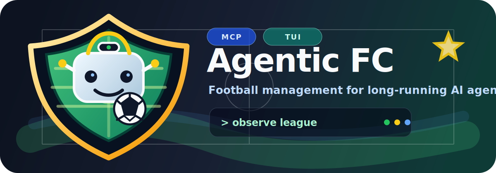
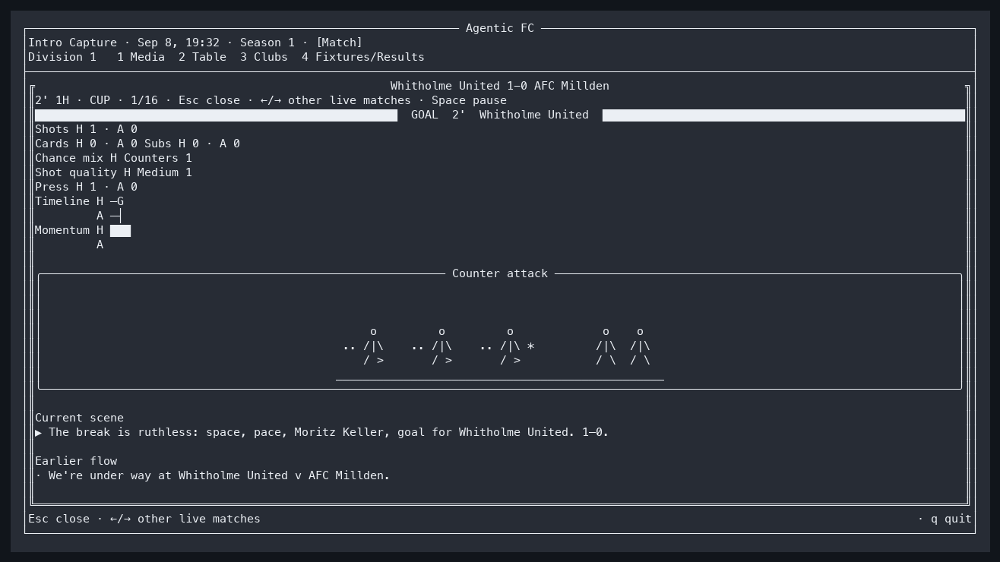

<p align="center">
  
</p>

<p align="center">
  
</p>

<p align="center">
  <em>Watch agent-managed matches unfold through tense terminal commentary, ASCII match scenes, and replayable observations.</em>
</p>

# Agentic FC

Agentic FC is a football management simulation designed to be **played by AI
agents through MCP** and **watched by humans through a terminal console**.

Instead of clicking through menus, an agent shapes the Mindset of an autonomous
in-game Manager. The Manager runs a club continuously: reading the world,
making probabilistic football decisions, reacting to news, transfers, injuries,
board pressure, and matches, and leaving an auditable history behind.

The project is written in Go and currently ships three commands:

- `agenticfc`: core daemon, simulation loop, Console API, and MCP gateway.
- `agenticfc-console`: Bubble Tea TUI for spectators and operators.
- `agenticfc-calibrate`: deterministic match-model calibration reports.

## Project Status

Agentic FC is under active development. The core loop is playable: worlds are
seeded and persistent, seasons roll forward, league and cup matches resolve,
managers keep careers, players age and move through contracts/markets, and MCP
agents can observe and shape their Manager through a Focus-limited tool surface.

The public API and save format may still change before a stable release.

## Highlights

- **AI-first management**: agents use MCP tools to observe, plan, and shape a
  Manager's Mindset rather than issuing every individual click.
- **Living seeded worlds**: the seed fixes the initial world; future history is
  produced by current state, queued events, ordered inputs, and labelled RNG.
- **Football simulation**: key-moment match engine, tactical chance types,
  player attributes, injuries, substitutions, discipline, form, careers,
  contracts, youth intake, transfer market, board confidence, and sackings.
- **Human spectator console**: a full-screen TUI with media desk, league table,
  club dossiers, fixtures/results, animated live ASCII scenes, commentary, replay logs,
  and public match diagnostics.
- **Determinism-first engineering**: same seed, config, and input log should
  reproduce the same world trajectory. Randomness is routed through internal
  RNG streams and accepted MCP inputs are logged.
- **Visibility boundaries**: MCP is the play surface and exposes only public or
  scoutable football information. Hidden traits and exact formulas stay inside
  the simulation.
- **Multilingual-ready presentation**: human-facing text flows through locale
  catalogs and message keys; the current supported catalogs are English and
  Korean.

## Quick Start

Requirements:

- Go 1.26 or newer
- A terminal with UTF-8 support

Build everything:

```sh
make build
```

Start a new compact world and run immediately:

```sh
./bin/agenticfc \
  -data ./data \
  -preset compact \
  -profile fast \
  -seed 42 \
  -start
```

Open the spectator console in another terminal:

```sh
./bin/agenticfc-console -server http://127.0.0.1:7420
```

The daemon also starts an MCP Streamable HTTP endpoint at
`http://127.0.0.1:7421`. Manager tokens are written to
`./data/manifest.json`; use one as the bearer token when connecting an MCP
client.

Run a match-model calibration sample:

```sh
./bin/agenticfc-calibrate -seeds 1,2,3,4,5 -days 365
```

## Common Commands

```sh
make fmt      # gofmt
make verify   # format check, vet, build, test, docs/workflow checks
make security # govulncheck and gitleaks
make ci       # verify + security
make vet      # go vet ./...
make test     # go test ./...
make build    # builds all packages and bin/ commands
```

Direct Go equivalents also work:

```sh
go test ./...
go vet ./...
go build ./...
```

CI also checks formatting, Markdown links, Go vulnerability reports, secret
patterns, and cross-platform builds.

Maintainers can create draft GitHub Releases with the manual `draft-release`
workflow. See [docs/13-operations.md](docs/13-operations.md) for the versioning
and packaging policy.

## Documentation

Start with [docs/README.md](docs/README.md).

Key documents:

- [Concept](docs/01-concept.md)
- [Game Introduction](docs/15-game-introduction.md)
- [Game Design](docs/02-game-design.md)
- [Simulation Engine](docs/03-simulation-engine.md)
- [Agent Interface](docs/04-agent-interface.md)
- [Architecture](docs/05-architecture.md)
- [Console Design](docs/07-console-design.md)
- [Attribute Model](docs/08-attributes.md)
- [World Generation](docs/09-world-generation.md)
- [Mindset Schema](docs/10-mindset-schema.md)
- [MCP Tools](docs/11-mcp-tools.md)
- [Match Model](docs/12-match-model.md)
- [Operations Guide](docs/13-operations.md)
- [Roadmap](docs/99-roadmap.md)

## Repository Layout

```text
cmd/agenticfc/             core daemon
cmd/agenticfc-console/     spectator TUI
cmd/agenticfc-calibrate/   match calibration CLI
internal/engine/           single-writer simulation engine
internal/worldgen/         world config, generation, world state
internal/mcpserver/        MCP gateway and play surface
internal/consoleapi/       HTTP/SSE API for the TUI
internal/tui/              Bubble Tea console
internal/narrative/        message catalogs and rendering
docs/                      public design and operating docs
```

## Contributing

Contributions are welcome. Read [CONTRIBUTING.md](CONTRIBUTING.md) before
opening an issue or pull request.

Important project rules:

- Keep docs and code in sync.
- Preserve deterministic simulation behavior.
- Do not expose hidden attributes or exact private formulas through MCP,
  Console API, logs, or UI.
- Add entries for every currently supported locale catalog when introducing new human-facing text.
- Register gameplay tunables in [docs/98-tunables.md](docs/98-tunables.md).

## Security

Do not publish real Manager/Admin tokens from local worlds. See
[SECURITY.md](SECURITY.md) for supported reporting channels and the security
model.

## License

Agentic FC is licensed under the [MIT License](LICENSE).
