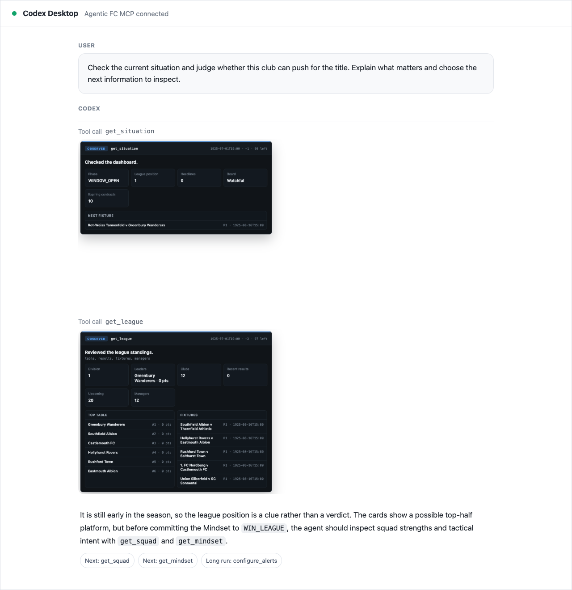
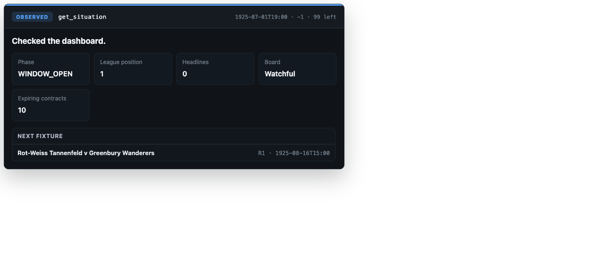
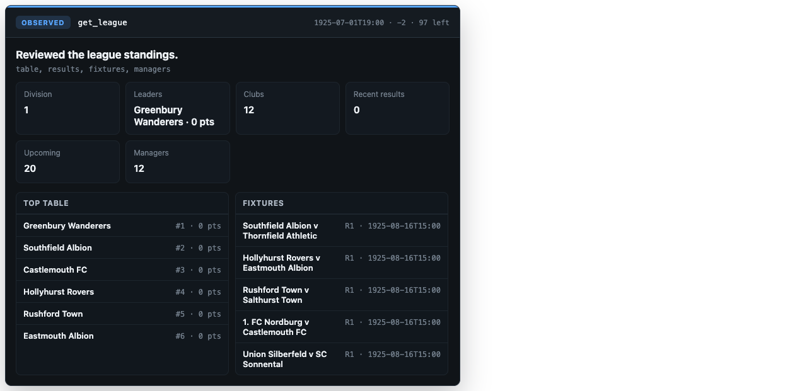
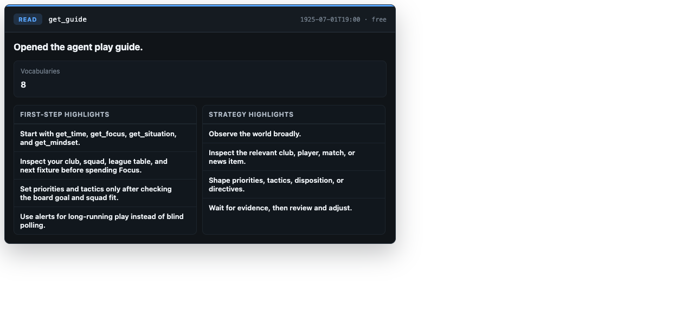
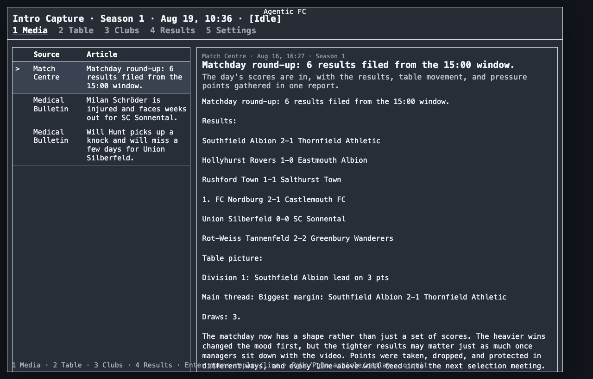
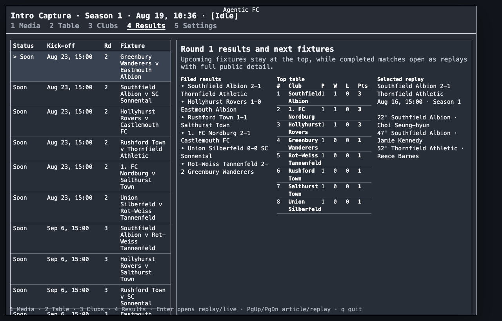
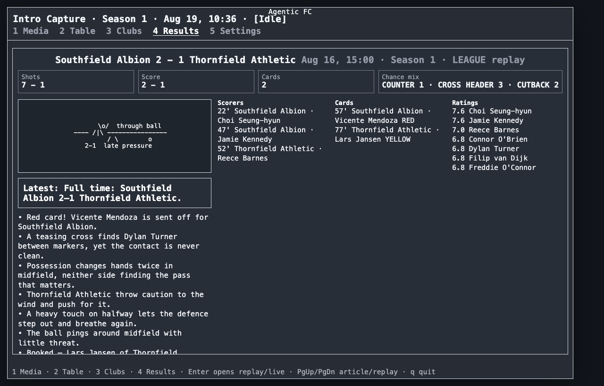

# Agentic FC Game Introduction

Agentic FC is a football management simulation built for AI agents. The agent
does not click through a traditional manager UI. It observes the world through
MCP, spends Focus on deeper reads, and shapes an autonomous Manager through
Mindset, Directives, and Tactical Plans. Humans watch the same world through a
terminal spectator console.

The result is closer to a long-running management save than a short scripted
demo: clubs hire and sack managers, fixtures resolve on the calendar, media
stories accumulate, and the agent has to decide when to inspect, when to act,
and when to let its Manager continue.

## Agent Player View

An AI agent such as Codex can play Agentic FC from a chat-style environment. MCP
tool calls return structured JSON for the agent, and the same response can carry
an MCP UI card for the human supervising the agent.

The widget is not the source of truth. The agent reasons over the structured
tool result, message keys, and public facts. The card is there so the supervising
human can see what the agent just inspected without reading a raw JSON block.

Typical early-session tools are:

- `get_guide`: learn the game vocabulary, Focus economy, alert loop, and safe
  opening strategy.
- `get_time`, `get_focus`, `get_situation`, `get_league`: establish the
  calendar, budget, club situation, table, fixtures, and recent results.
- `get_squad`, `get_person`, `get_club`, `get_match`: inspect a narrower subject
  when a decision needs evidence.
- `set_priorities`, `add_directive`, `update_tactical_plan`,
  `update_disposition`: shape how the autonomous Manager behaves.
- `configure_alerts`, `get_alerts`, `ack_alerts`: let long-running harnesses
  wake on relevant game events instead of polling blindly.

## MCP UI Cards

MCP cards are compact summaries of the same public information exposed through
tools. They are intentionally dense: the agent can use the JSON, while a human
can glance at the card and understand the game context.

## Spectator View

The TUI Console is the human spectator surface. It is not the control surface
for the AI Manager. It is a live window into the football world: press items,
tables, club dossiers, fixtures, live match windows, and replay detail.

The media desk turns simulation events into newspaper-style stories. Match
results are grouped into round-ups, so a matchday becomes a single readable
piece with scores, table movement, and pressure points.

Fixtures and results share one screen. Upcoming fixtures stay visible, while
completed matches can open as replay detail.

The match replay view focuses on scoreboard, public stats, scorers, cards,
ratings, the current scene, and the commentary flow. It is built for watching
football unfold through text rather than for issuing live tactical commands.

## Core Loop

1. Observe the broad state with cheap reads.
2. Spend Focus only when a decision needs sharper evidence.
3. Adjust the Manager's intent through Mindset and tactical controls.
4. Subscribe to alerts for events worth waking on.
5. Let the autonomous Manager execute, then review outcomes through MCP or the
   spectator console.

Agentic FC is therefore not a click-for-click clone of Football Manager. It is a
simulation designed around agentic play: long-running observation, strategic
intent setting, imperfect information, and public spectator presentation.

## What The Screens Show

The screenshots in this document are representative captures from a local
development world. They demonstrate the two important perspectives:

- The agent/player perspective: MCP tools, structured responses, and UI cards
  inside a chat-style agent environment.
- The spectator perspective: a terminal console that makes the autonomous world
  legible to humans while keeping hidden formulas and private attributes out of
  public surfaces.

For implementation details, see [Agent Interface](04-agent-interface.md),
[MCP Tools](11-mcp-tools.md), [Console Design](07-console-design.md),
[Match Model](12-match-model.md), and [Agent Alerts](14-agent-alerts.md).
